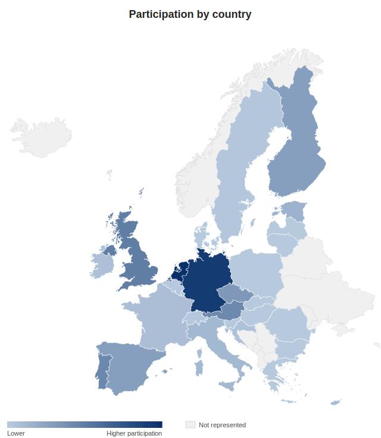



This guide is the result of a multi-stakeholder effort involving experts from many European countries, projects and initiatives. It is published under the [Euridice](https://euridice.org/) initiative — *European Interoperability Specifications for Digital Solutions in Healthcare* — as the [EU Imaging Report FHIR IG](https://euridice.org/specifications-imaging-report-fhir-ig/), and is developed as a joint **HL7 Europe ↔ IHE Europe** collaboration.

This guide exists thanks to the people and organizations who gave their time and expertise. We gratefully acknowledge all participants of the weekly HL7 Europe Imaging working sessions — national competence centres, ministries of health, clinical experts, and industry from across Europe — as well as the European Commission and the **EHDS** initiative that frames this work, and the collaborating Xt-EHR, XpanDH, xShare, MyHealth@EU and IHE communities. The tables below give credit to the editorial team and the individual participants who shaped this work.

The semantic and functional requirements are provided by the **[European Health Data Space (EHDS) Regulation](https://health.ec.europa.eu/ehealth-digital-health-and-care/european-health-data-space-regulation-ehds_en)** and the **[Xt-EHR (WP 7.2)](https://www.xt-ehr.eu/)** project. The EHDS is the EU legislation that set this effort in motion: it mandates the cross-border exchange of priority categories of health data — including **medical images** — and thereby established the need for shared European imaging specifications, which Xt-EHR translates into logical models and detailed requirements.

It builds on, and shares contributors with, related European efforts including **[Xt-EHR (WP 7.2)](https://www.xt-ehr.eu/)**, **[XpanDH](https://xpandh-project.iscte-iul.pt/)**, **[xShare](https://xshare-project.eu/)**, **[MyHealth@EU](https://health.ec.europa.eu/ehealth-digital-health-and-care/electronic-cross-border-health-services_en)**, and the imaging-manifest / **[IHE-MADO](https://euridice.org/mado/)** profiling work.

### Editorial team and governance

| Role | Name | Organization | Representing |
|------|------|--------------|--------------|
| Co-chair / Project facilitator | Bas van den Heuvel | Philips Healthcare | HL7 Europe |
| Co-chair / Project facilitator | Marc Kämmerer | VISUS Health IT | IHE Europe |
| Editor / Developer | Ignacio Jauregui | Philips Healthcare | Netherlands |

### Contributors

The participants represent organizations from 20 countries (plus international vendor participation). The map below shades each country by its combined participation, with every EU member state highlighted as in scope:

Although many participants contributed over the development of the specification, we like to mention the most active participants:

| Contributor | Country | Organization |
|-------------|---------|--------------|
| Bas van den Heuvel | Netherlands | Philips Healthcare |
| Kari Heinonen | Finland | — |
| Neil Robinson | England | IHE-UK, IHE MCWG (Imaging) |
| Dario Espinosa Garcia | Spain | Ministry of Healthcare |
| Krishnamoorthi Govindan | Germany | mio42 GmbH |
| Pavlina Vranova | Czech Republic | OR-CZ spol. s.r.o. |
| Reinhard Egelkraut | Austria | HL7 Austria; CGM Clinical |
| Marc Kämmerer | Germany | IHE Europe, VISUS Health IT GmbH |
| Ignacio Jauregui | Netherlands | Philips Healthcare |
| Nikolaus Krondraf | Austria | ELGA GmbH |
| Fernanda Bigolin | Portugal | SPMS |
| Helton Yukio Hatori | Portugal | SPMS |
| Julia Flis | Germany | mio42 GmbH |
| John George | England | NHS England |
| Jonas Schön | Germany | HL7 Germany, Gefyra GmbH |
| Esther Peelen | Netherlands | Nictiz |
| Giorgio Cangioli | Italy | HL7 Europe |
| Josh Priebe | EU | Epic |
| Rick Busbridge | Netherlands | Nictiz |
| David Wattien | Netherlands | Nictiz |

